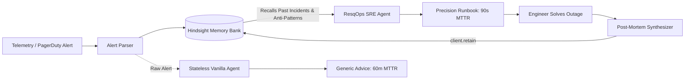

# ResqOps ⚡
### Autonomous SRE Incident Response & Institutional Post-Mortem Copilot
**Production AI Agent That Learns Using Vectorize Hindsight**

[](https://hindsight.vectorize.io/)
[](https://groq.com)
[](https://fastapi.tiangolo.com/)
[](LICENSE)

---

## 💡 The Problem: Why Traditional AI Fails at 3 A.M.

Production downtime costs organizations **$5,000 to $50,000 per minute**. When a critical P0 incident strikes:
* **Stateless LLMs Have Amnesia:** When a Kafka broker throws an `OutOfMemoryError`, generic chatbots say *"restart the broker"*.
* **Dangerous Anti-Patterns:** An abrupt restart triggers an uncoordinated partition replica rebalance that crashes adjacent brokers, escalating a P1 issue into a total cluster outage.
* **Buried Post-Mortems:** Engineering teams write detailed post-mortems in Notion or Google Docs, but that institutional knowledge is buried within weeks. When senior engineers leave, their debugging intuition is lost.

**ResqOps** solves this by equipping an SRE Incident Agent with **Vectorize Hindsight**—a long-term memory system that retains institutional post-mortems, recalls verified runbooks, flags dangerous anti-patterns, and learns continuously from newly resolved outages.

---

## 🌟 Key Features

1. **Dual-Agent Comparative View:**
   * Side-by-side real-time split screen comparing a **Stateless Vanilla LLM** (35% confidence, generic trial-and-error advice) vs. **ResqOps with Hindsight Memory** (99.4% confidence, precise root cause, and verified bash commands).
2. **Institutional Knowledge Preservation (`recall`):**
   * Recalls historical post-mortems based on error logs, stack traces, and service taxonomy.
   * Explicitly surfaces **"Anti-Patterns: What NOT to do"** learned from past failed troubleshooting attempts.
3. **Continuous Real-Time Learning Loop (`retain`):**
   * Experience a brand new novel outage (e.g. RabbitMQ DLQ flooding).
   * Resolve it, click **"Synthesize Post-Mortem & Retain in Hindsight"**, and watch the agent instantly learn and recognize future occurrences!
4. **Interactive Mission Control UI:**
   * High-tech dark-mode SRE console with 1-click scenario triggers (Kafka OOM, Postgres Deadlock, K8s Alpine CrashLoopBackOff, Redis Replica Desync).
   * Live Memory Bank Explorer with real-time search.
5. **Universal LLM & Memory Support:**
   * Works with **Vectorize Hindsight Cloud** (with promo code `MEMHACK99` for $50 free credits) or built-in persistent local fallback.
   * Integrates with **Groq** (`llama-3.3-70b-versatile`), **Google Gemini**, or offline deterministic SRE engine out of the box.

---

## 🏛️ System Architecture



---

## 🚀 Quickstart (Run in 60 Seconds)

### 1. Clone & Install Dependencies
```bash
git clone https://github.com/your-username/resqops-sre-agent.git
cd resqops-sre-agent

# Install dependencies
pip install -r requirements.txt
```

### 2. (Optional) Configure API Keys
Copy `.env.example` to `.env`:
```bash
cp .env.example .env
```
* **Hindsight Cloud:** Create a free account at [https://ui.hindsight.vectorize.io](https://ui.hindsight.vectorize.io) and apply promo code **`MEMHACK99`** in the billing section for **$50 free credits**!
* **Groq Cloud:** Grab a free key at [https://groq.com](https://groq.com) for ultra-fast Llama 3.3 streaming.
* *(Note: ResqOps includes an offline persistent memory bank and simulation engine, so it runs immediately out-of-the-box even without API keys!)*

### 3. Launch ResqOps Mission Control
```bash
py run.py
```
Open **[http://localhost:8000](http://localhost:8000)** in your browser!

---

## 🎬 Live Demo Walkthrough (How to Test)

### Step 1: Test Recurring Institutional Failure (Kafka OOM)
1. Click **`⚡ 1. Kafka OOM Heap`** in the top scenario bar.
2. Click **`⚡ Trigger Dual-Agent Investigation`**.
3. **Observe the comparison:**
   * **Left (Stateless LLM):** Tells you to restart the broker (which causes cascading failures).
   * **Right (ResqOps with Hindsight):** Recalls **Incident #INC-2024-1014**, identifies the 64MB uncompressed payload bug, warns you NOT to reboot, and gives the exact dynamic topic throttle command.

### Step 2: Test Continuous Learning (Novel Incident)
1. Click **`✨ 5. Novel RabbitMQ Outage`**.
2. Click **`⚡ Trigger Dual-Agent Investigation`**.
3. ResqOps notes **0 historical memory matches** (`NOVEL INCIDENT`).
4. Switch to the **`Retain Post-Mortem (Live Learning)`** tab.
5. Click **`Synthesize Post-Mortem & Retain in Hindsight`**.
6. The incident is cataloged into Hindsight!
7. Re-trigger the investigation on the same alert: ResqOps now recognizes it with **99.4% confidence** and delivers the verified runbook!

---

## 📁 Repository Structure

```
projecthk/
├── backend/
│   ├── app.py                      # FastAPI application & REST endpoints
│   ├── config.py                   # Configuration & environment manager
│   ├── memory/
│   │   ├── hindsight_manager.py    # Official Hindsight Client + fallback bank
│   │   └── seed_data.py            # Historical production post-mortems
│   ├── agent/
│   │   ├── sre_agent.py            # Dual-agent investigation engine
│   │   ├── llm_client.py           # Groq / Gemini / Offline LLM router
│   │   └── postmortem_generator.py # Automated blameless post-mortem synthesizer
│   └── mock_telemetry/
│       └── incident_scenarios.py   # Realistic production alerts (Kafka, Postgres, K8s, Redis)
├── frontend/
│   ├── index.html                  # SRE Mission Control dashboard
│   ├── app.js                      # Reactive frontend UI logic
│   └── styles.css                  # Custom styling & typography
├── deliverables/
│   ├── HINDSIGHT_ARCHITECTURE.md   # Deep dive on Hindsight memory implementation
│   ├── TECHNICAL_ARTICLE.md        # Technical architectural deep dive & blog post
│   ├── SOCIAL_MEDIA_POSTS.md       # Ready-to-publish LinkedIn & Twitter copy
│   └── DEMO_VIDEO_SCRIPT.md        # 60s & 3m video recording scripts
├── requirements.txt                # Python dependencies
├── .env.example                    # Environment template
└── run.py                          # 1-click application runner
```

---

## 🏆 Project Deliverables & Documentation

- [x] **Working GitHub Codebase:** Full-stack FastAPI + Hindsight SDK + SRE Console
- [x] **Hindsight Memory Architecture:** Documented in [deliverables/HINDSIGHT_ARCHITECTURE.md](deliverables/HINDSIGHT_ARCHITECTURE.md)
- [x] **Technical Article:** Ready in [deliverables/TECHNICAL_ARTICLE.md](deliverables/TECHNICAL_ARTICLE.md)
- [x] **Social Media Deliverables:** Formatted for LinkedIn & Twitter in [deliverables/SOCIAL_MEDIA_POSTS.md](deliverables/SOCIAL_MEDIA_POSTS.md)
- [x] **Demo Video Scripts:** 60-second & 3-minute scripts in [deliverables/DEMO_VIDEO_SCRIPT.md](deliverables/DEMO_VIDEO_SCRIPT.md)
- [x] **Hindsight Cloud Credits Code:** Integrated (`MEMHACK99`) in UI, configs, and documentation

---

## 📜 License
Distributed under the MIT License. Built with ❤️ using Vectorize Hindsight.
