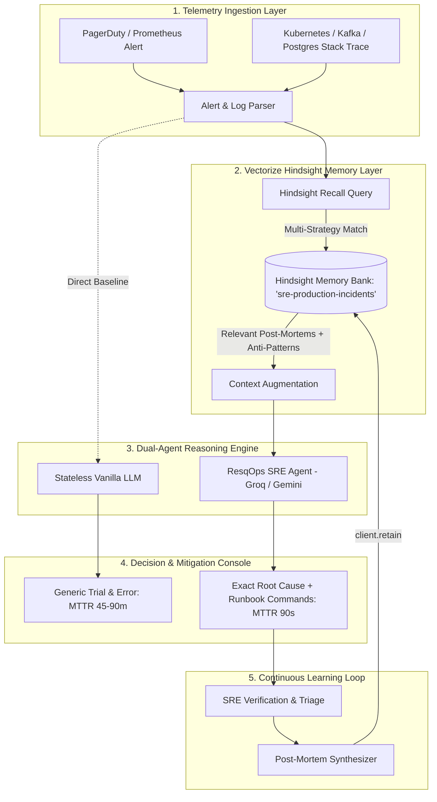

# ResqOps: Architectural Blueprint & Hindsight Memory Integration

> **Project Name:** ResqOps  
> **Core Technology:** Vectorize Hindsight Agent Memory Engine  
> **Target Domain:** DevOps / Site Reliability Engineering (SRE) / Incident Response  
> **Hackathon Track:** AI Agents That Learn Using Hindsight  

---

## 1. Executive Summary & Problem Formulation

In modern engineering organizations, production outages cost an average of **$5,000 to $50,000 per minute**. When a critical P0 incident strikes (e.g., database connection pool exhaustion, Kafka broker panic, or Kubernetes CrashLoopBackOff), the Mean Time To Resolution (MTTR) is typically dictated by **how quickly the on-call engineer can find institutional knowledge**.

### The Core Problem with Standard AI Chatbots:
1. **Stateless Amnesia:** A standard LLM (GPT-4, Llama 3) does not know your infrastructure history. When shown an `OutOfMemoryError` on Kafka, it hallucinates generic advice like *"restart the broker"* or *"increase pod RAM"*.
2. **Dangerous Anti-Patterns:** In a previous outage, restarting that broker triggered an uncoordinated partition replica storm that took down two additional brokers. Standard LLMs have no memory of past failed attempts.
3. **Lost Post-Mortems:** Companies write extensive Markdown post-mortems in Google Docs, Notion, or Confluence. Within three weeks, that knowledge is buried and forgotten. Senior engineers leave the company, and their hard-won debugging intuition vanishes.

### The Solution: ResqOps with Vectorize Hindsight
**ResqOps** is an autonomous SRE Incident Response & Post-Mortem Copilot powered by **Vectorize Hindsight**. Rather than treating alerts in isolation, ResqOps retains institutional memory of every past incident, every failed troubleshooting step, and every verified mitigation runbook. When an alert fires, Hindsight recalls the exact historical failure signature and prescribes the proven fix in seconds.

---

## 2. Architecture & Data Flow



---

## 3. How Vectorize Hindsight is Implemented

ResqOps integrates directly with the official `hindsight-client` Python SDK using the three core pillars of the Hindsight memory model:

### A. Memory Bank Structure (`bank_id: "sre-production-incidents"`)
Memories are scoped to an institutional memory bank representing production infrastructure. Each retained record consists of:
* **Rich Incident Content:** Standardized Markdown structure detailing the service, severity, timeline, and exact root cause.
* **Metadata Attribution:** `incident_id`, `service`, `severity`, `date`, `telemetry_signatures`.
* **Knowledge Tags:** Granular taxonomy tags (`kafka`, `jvm`, `heap`, `connection-pool`, `crashloopbackoff`, etc.).

### B. Precision Retention (`client.retain()`)
Whenever an on-call engineer mitigates an outage or provides resolution notes, ResqOps formats the experience into an institutional post-mortem and commits it:

```python
from hindsight_client import Hindsight

client = Hindsight(
    base_url="https://api.hindsight.vectorize.io",
    api_key=settings.HINDSIGHT_API_KEY
)

response = client.retain(
    bank_id="sre-production-incidents",
    content=post_mortem_markdown,
    metadata={
        "incident_id": "INC-2024-1014",
        "service": "kafka-ingress-cluster",
        "severity": "P1",
        "root_cause": "Upstream batch size violation with uncompressed 64MB payloads."
    },
    tags=["kafka", "jvm", "heap", "oom", "consumer-lag"]
)
```

### C. Multi-Strategy Recall (`client.recall()`)
When an active production alert fires, ResqOps extracts key telemetry signatures and stack trace tokens, querying the memory bank:

```python
# Multi-strategy recall across semantic, keyword, and entity graphs
recalled = client.recall(
    bank_id="sre-production-incidents",
    query=f"{service} {alert_name} {raw_logs}",
    max_tokens=4096
)
```

Hindsight extracts relevant observations and causal relationships rather than naive chunk similarity. If an identical error signature or underlying service dependency triggered an outage 6 months ago, Hindsight surfaces the specific resolution commands and highlights the **Failed Attempts** so the engineer avoids destructive actions.

---

## 4. Key Innovation: Before vs After Comparison

| Capability | Stateless SRE Agent (Vanilla LLM) | ResqOps (Powered by Hindsight) |
| :--- | :--- | :--- |
| **Alert Comprehension** | Generic understanding of error tokens. | Institutional contextualization linked to past incidents. |
| **Mitigation Speed** | 45 to 90 minutes of manual hypothesis testing. | **60 to 90 seconds** (Pre-verified script execution). |
| **Awareness of Anti-Patterns** | Zero. Might recommend rebooting a database that would cause a connection stampede. | Explicitly warns: *"Do NOT reboot broker-02; past incident #104 proved this causes partition rebalance storms."* |
| **Learning Over Time** | Zero retention. Next week, the agent starts from scratch. | **Cumulative knowledge compounding.** Every incident permanently enriches the organization's SRE intelligence. |

---

## 5. Technical Stack

* **Memory Engine:** Vectorize Hindsight Cloud (`hindsight-client` Python SDK) + Persistent Fallback Cache
* **LLM Engine:** Groq Cloud (`llama-3.3-70b-versatile` for sub-second streaming inference) / Google Gemini API / Offline Deterministic SRE Engine
* **API Backend:** FastAPI, Uvicorn, Pydantic, Python-Dotenv
* **Frontend:** Modern Dark-Mode SRE Mission Control UI (Tailwind CSS, Glassmorphic Dashboard, Monospace Terminal Emulator)
